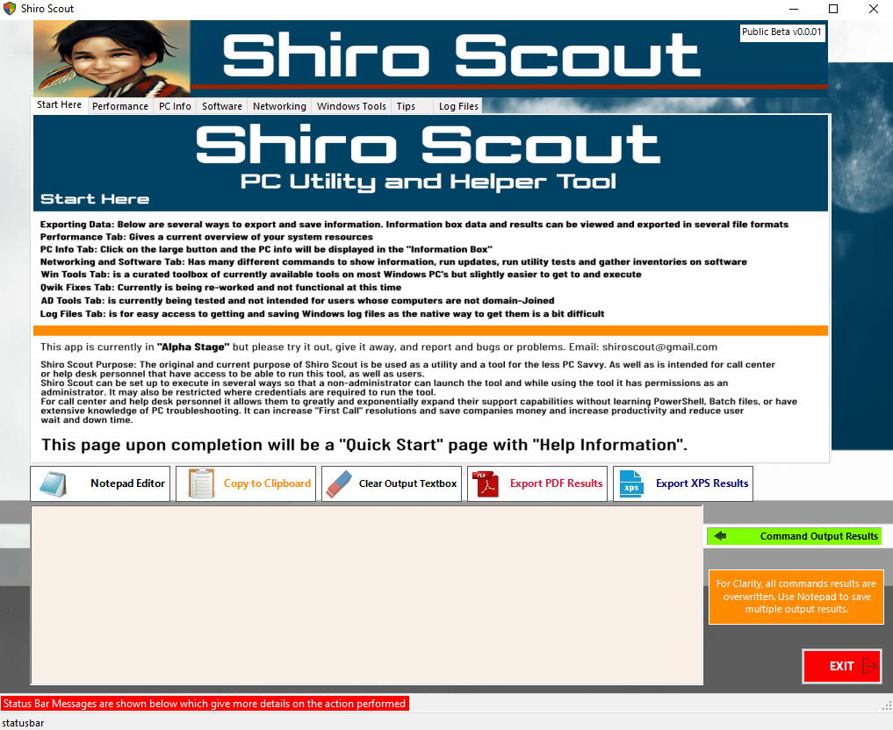
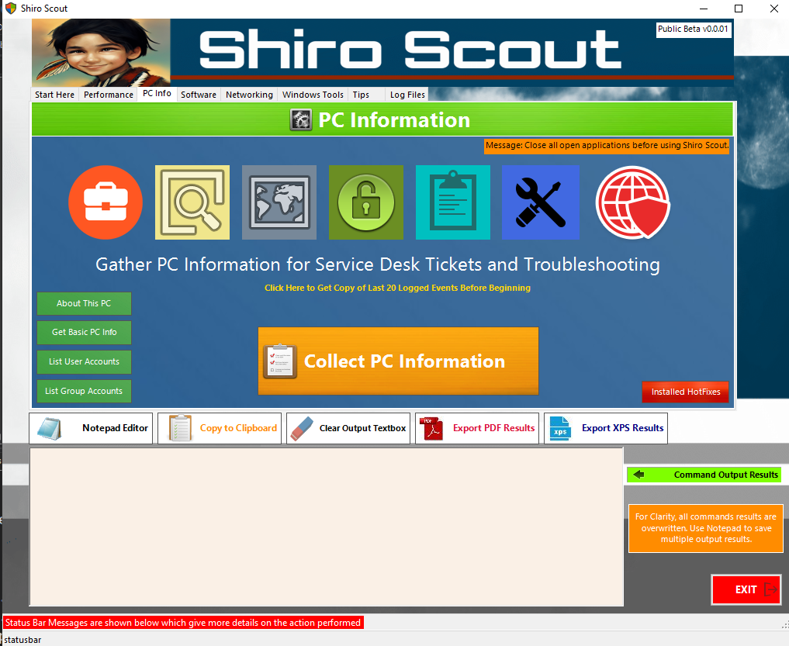
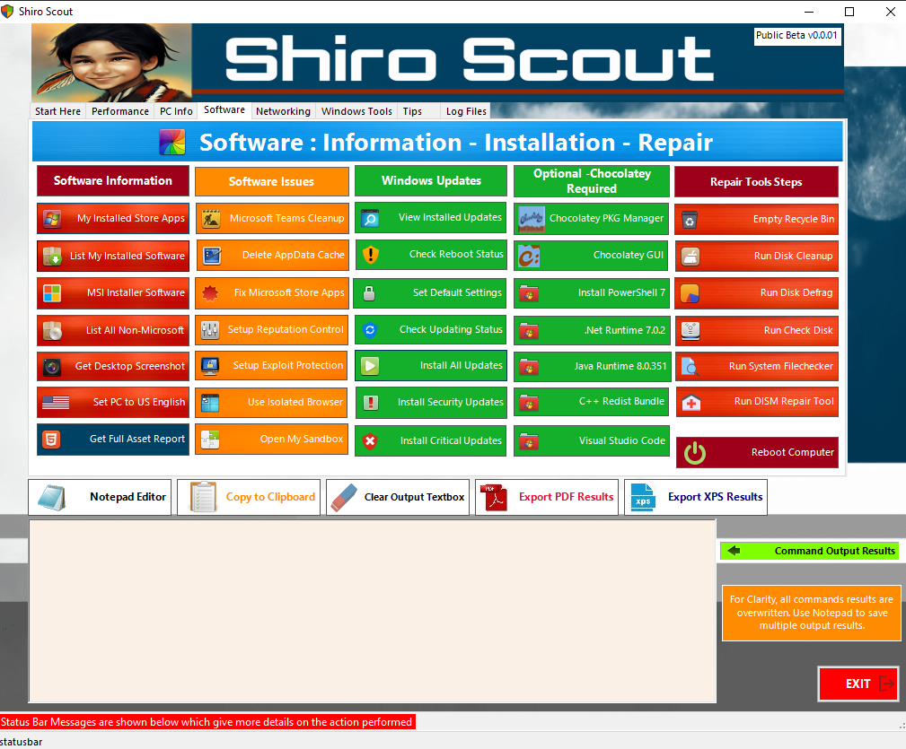
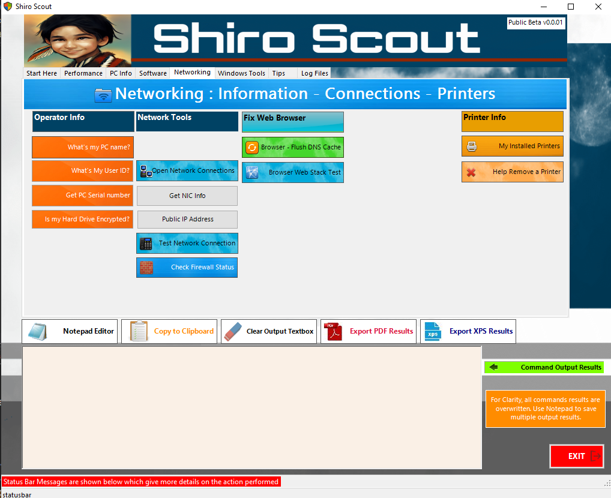
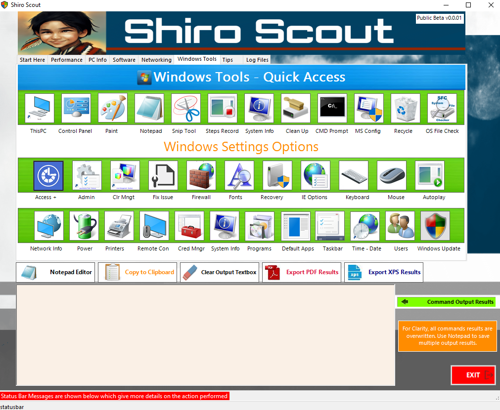
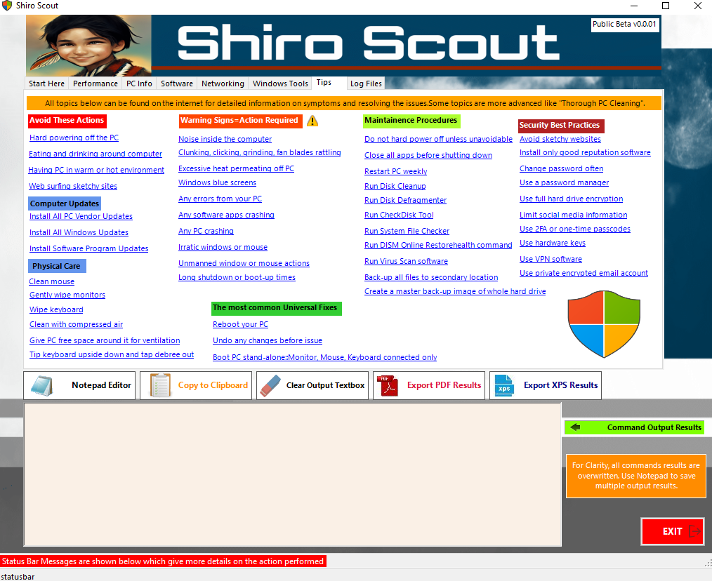
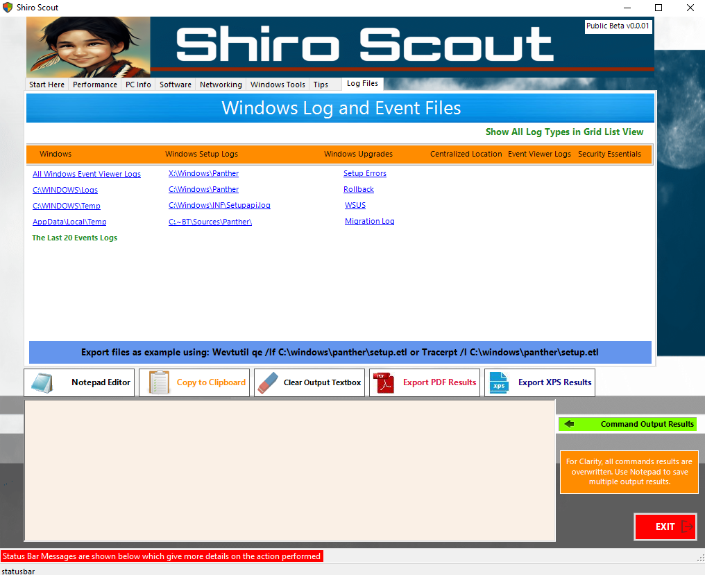

# ShiroScout-PowerShellGUI-App

### This is a PowerShell GUI App created with Sapiens Tool PowerShell Studio. The build is current will build and function. I have not had time yet to complete TABS Networking and Log Files. All the rest of the project is mostly completed.

### This app is rightly more of a Utility for PC Health and gathering information.

### It is best used for Help Desk, or internal corporate of business IT Support where they can run the program using RDP or similar tools.

### Within just a few minutes support personnel can gather large information about a specific pc, settings, apps, log files, and use that info right then for fixing issues or post as notes or attachment in a ticketing system for higher tier support to use.

### I address, what I consider after 24 years of desktop support the most crucial items, and fast resolve to root cause. There is an infinity of possibilities, and this is not a fix-all app, it is a fix-most-likely cause app asap.

### I think call center, and help desk people are valuable, but their implementation is wrong and not used optimally. I think it wasteful of companies to pay someone to create a ticket, and get contact info \$15-20 dollars an hour, where-as instead give them remote access and have them use a tool that is designed specifically designed to get to root , probably cause, and possibly fix issue on 1st contact resolution.

### This tool runs PowerShell commands at a click of a button, and the tool is meant to be custom designed for required use, and allowed commands, and script executions is to the discretion of the creator/designer of the app.

### This app is designed as an End-User app, but different tool types can be created for different roles, different uses, etc… such as Azure, SQL, Win AD or other roles.

### For those , such as help desk people it also greatly multiplies their skills and capabilities to fix issues without actually having to know PowerShell, Scripts or other types of batch files, etc… All they will need to know is that it is an” Approved Tool for Use” and have document or manual on the tools, buttons, and how they can use the tool.

### Is this tool safe? You can freely view, edit or modify the code. YES, in-a-nutshell. If affects only the single users PC. It does not go and modify anything in Windows AD, other servers, etc…

### This tool was created as a fun project, and a functional tool to be used. I did not do all the coding in the tool. The tool uses many peoples partial code, and my current code inside files is messy and a true PowerShell Guru would have a heart attack looking at my code and scripts.

### I heavily used LazyWinAdmin PowerShell Script for learning. Francois script is a beautiful piece of artwork in my opinion. He has some great articles as well at: <https://lazywinadmin.com/> and his github is: [lazywinadmin (François-Xavier Cat) (github.com)](https://github.com/lazywinadmin).

### I also looked at app BatchPatch, PDQ Blogs, searched many github PowerShell Scripts, as well as very heavy use and training of Sapiens website, especially their PowerShell Forum, Script Forum, Info Center and their online manual.

### I think there are close to 150 references I could add, but in general I would like to thank ALL people who post their learning, findings, testing, Home IT Labs, and share knowledge online as it is an invaluable tool of sharing that has helped code, automation and many other areas of our entire world as we know it.

